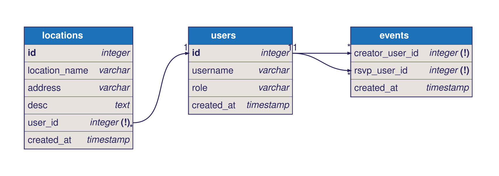

# <API name> Proposal

## 1. The pitch (one paragraph)
What the API does, who uses it, and why a client app would need it.

## 2. Resources
| Resource | Key fields | Relationships |
|---|---|---|
| User | id, email, displayName, role | a User has many Workouts |
| ... | ... | ... |

## 3. ER sketch
Tables, primary and foreign keys, and cardinality. Edits to [.dbml](.dbml) automatically get rendered here through a workflow.

## 4. Endpoints
| Verb | Path | Auth | Purpose |
|---|---|---|---|
| GET | /api/v1/workouts?page=0&size=20 | user | list my workouts (paginated) |
| ... | ... | ... | ... |
Mark each endpoint `public`, `user`, or `admin`. Mark which collection paginates and which
filters or sorts.

## 5. Technical choices
- **Database host:** (Neon, Supabase, Railway, Atlas, ...) and why
- **OAuth2 provider:** (Google, GitHub, Auth0) and confirmation that it supports Authorization Code + PKCE from a native app
- **Repo layout:** monorepo or split, and why
These become your ADRs later.

## 6. Risks
The two things most likely to go wrong, and what you will do first to find out.

## 7. Team and Sprint 1
Who owns what in Sprint 1. Link your Project board and Sprint 1 milestone.
